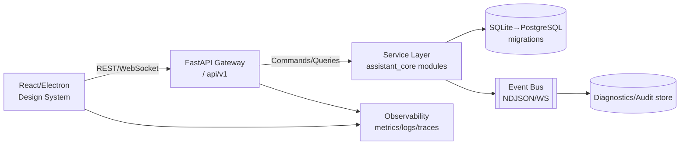

## target architecture (v+1000)
- Clean layers: UI (React/Electron) → API Gateway (FastAPI) → service layer (assistant_core domain modules) → persistence (SQLite→PostgreSQL) → async/eventing (diagnostics + audit bus).
- Single canonical API app (`assistant_hub.api.server`) exposing versioned routes (`/api/v1/...`), with compatibility mount for legacy `/api/*`.
- Shared contracts: Pydantic response models, OpenAPI generation, typed React client (OpenAPI TS generator) + hooks for SWR/React Query with cache and stale-while-revalidate.
- Persistence: Alembic migrations, schema version table, seed data for demo mode, deterministic data dir; future move to Postgres with connection config.
- Observability: Structured logs with correlation/request IDs, metrics exporter (Prometheus FastAPI middleware), trace stubs; health/readiness/liveness endpoints.
- Security: JWT/session tokens with role claims (admin/operator/user/viewer), API key support for agents; CORS tightened; secure headers; input validation; rate limits; audit log stream.

## module boundaries
- UI: design system components (layout grid, nav shell, cards/tables/forms, status badges), pages (Dashboard, Projects, Runs/Jobs, Logs/Observability, Settings, Integrations, Auth, Help), data hooks bound to typed client.
- API: routers grouped by domain (dashboard/projects/tasks/monitoring/runtime_diagnostics/integrations/writer/analytics/security/network); dependency providers for DB, config, auth; error middleware returning uniform `{code,message,correlation_id,details}`.
- Services: domain modules in `assistant_core` (projects/tasks, analytics, monitoring, network/security, reasoning) with clear interfaces; adapters for external APIs via IntegrationAPIGateway.
- Persistence: repository interfaces (TasksRepo, ProjectsRepo, TelemetryRepo) backed by SQLite now, switchable to Postgres; migrations and seeds.
- Async/eventing: NDJSON audit log + WebSocket feed for runtime diagnostics, with queue for future pub/sub.

## data model overview and migration approach
- Core tables: users, roles, sessions, projects, tasks, integrations, diagnostics_events, dashboards (materialized snapshots), settings.
- Add `schema_migrations` table; manage via Alembic; initial migration creates tables + indexes on project_id, updated_at.
- Seed: demo user + demo projects/tasks; diagnostics sample events; stored under data dir.

## ui information architecture
- Global nav: Dashboard, Projects, Runs/Jobs, Logs & Observability, Integrations, Settings, Help.
- Dashboard: system health, plane status, active projects/tasks, recent diagnostics (live feed), quick actions.
- Projects: list + detail (tasks, ledger, integrations); pagination + filters.
- Runs/Jobs: recent automation runs with status, duration, artifacts.
- Logs/Observability: runtime diagnostics stream, filters by severity/component, link to health checks.
- Settings: profile, tokens, data directory, theme, notification preferences; admin-only toggles.
- Integrations: catalog + connection status; actions to configure credentials.
- Auth: login/logout flows; session badge in header; role-based UI gating.

## observability plan
- Metrics: request latency/count/error, DB query timings, background job durations (Prometheus).
- Logs: structured JSON with correlation/request IDs; rotate files under `logs/`.
- Traces: stub OpenTelemetry exporter toggled via env.
- Health probes: `/api/healthz` (liveness), `/api/readyz` (DB + migrations), `/api/runtime/diagnostics/ping`.

## security model
- Roles: admin, operator, user, viewer; route-level dependency guards.
- Auth: JWT or signed session cookie; CSRF token for browser POST; API keys for automation with scoped permissions.
- Secrets: `.env.example` + `.env.local` (gitignored); strict config loader; secrets masked in logs.
- Rate limits + input validation on command execution and AI calls; allowlist for shell commands in automation endpoints.

## release strategy (incremental)
- Increment 1: consolidate API entrypoint, add shared error/correlation middleware, ready/health endpoints, and OpenAPI typed client; add minimal auth (token header).
- Increment 2: introduce Alembic migrations + deterministic data dir; seed demo data; add contract tests for dashboard/projects/tasks/runtime_diagnostics; wire frontend hooks to live data with loading/error states.
- Increment 3: observability (metrics/logs/trace stubs), audit NDJSON stream + WebSocket; UI Logs page; pagination and limits on list endpoints.
- Increment 4: role-based UI/route guards; integrate integrations catalog page; add CI workflow running lint/pytest/vitest/semgrep.
- Increment 5: perf and reliability (caching, indexes, retries/backoff), load-test harness for critical endpoints; deprecate legacy router wiring.
